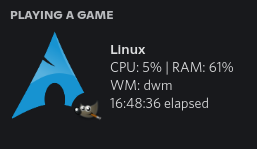

# RPC++
RPC++ is a tool for Discord RPC (Rich Presence) to let your friends know about your Linux system


## Installing requirements
---
### Arch based systems
```
pacman -S xdotool unzip
```
### Debian based systems
```
apt install xdotool unzip -y
```

## Building
---
**GNU Make**, **xdotool** and **Discord Game SDK** are **required**. To see more information about setting up Discord Game SDK, see [DISCORD.md](./DISCORD.md)

To build RPC++, use the command: 
```
make
```

## Installing & Running
To install RPC++, run the this command:
```
sudo make install
```
You can run the app from any directory with
```
rpcpp
```

To run manually you need to start first `rpcfetch.sh` and then start `rpcpp` with the variables `LD_LIBRARY_PATH="$LD_LIBRARY_PATH:$(pwd)/lib"`

## Features
---
- Displays your distro with an icon (supported: Arch, Gentoo, Mint, Ubuntu, Manjaro)
- Displays the focused window's class name with an icon (see supported apps [here](./APPLICATIONS.md))
- Displays CPU and RAM usage %
- Displays your window manager (WM)
- Displays your uptime
- Refreshes every second
  


## Will you add more application/distro support?
---
Sure, let me know on my [discord server](https://grial.tech/discord)! Though I'm pretty sure Discord has a limit of images that can be uploaded per application.

## Contributing
---
You can make pull requests, to improve the code or if you have new ideas, but I don't think I will update the code very often.

## Supporting
---
Want to support me? That's great! Joining my [discord server](https://grial.tech/discord) and subscribing to my [YouTube channel](https://www.youtube.com/channel/UCi-C-JNMVZNpX9kOs2ZLwxw) would help a lot!

Are you a rich boi? You can send me XMR through this address:
```
48DM6VYH72tRfsBHpLctkNN9KKPCwPM2gU5J4moraS1JHYwLQnS1heA4FHasqYMA66SVnusFFPb3GAyW5yBPBwLRAKJuvT1
```